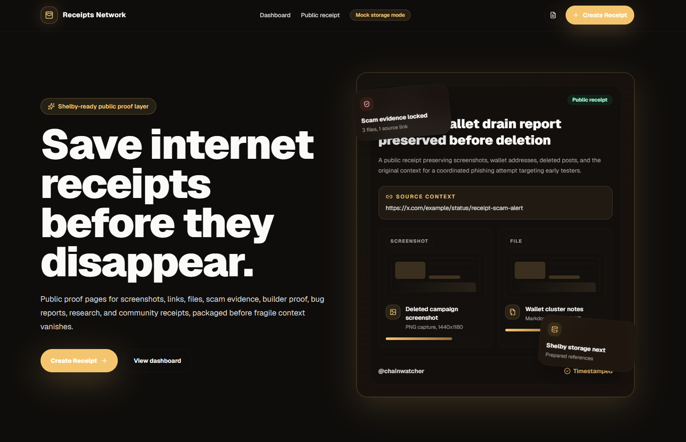

# Receipts Network

Receipts Network is a public receipt layer for saving important internet proof before it disappears.

The project is built for situations where proof gets scattered, edited, deleted, or buried across chats, screenshots, links, forms, and private folders. A receipt can preserve context around scam reports, builder work, bug reports, community activity, research sources, grant/application evidence, and creator proof.

The current MVP is live, frontend-first, and Shelby-ready.

**Live product:** https://receipts-network.pages.dev  
**Repository:** https://github.com/vaibhav0xq/receipts-network

---

## Preview

### Homepage



### Create receipt flow


### Receipt command center


---

## What it does

Receipts Network lets users create a clean public receipt page with:

- receipt title
- category
- creator handle
- source URL or context
- description
- tags
- evidence file metadata
- public receipt link
- dashboard listing
- storage references

The MVP currently stores receipt metadata in Supabase and keeps a local browser fallback for reliability. Evidence files are handled as metadata in the current version while the storage adapter is prepared for Shelby integration.

---

## Why this exists

In Web3 and online communities, proof is fragile.

A scam message can be deleted.  
A project claim can be edited.  
A bug report can get buried.  
A builder update can disappear in a chat thread.  
A grant or application proof can be scattered across multiple places.

Receipts Network gives users a simple way to package that context into one shareable receipt page.

---

## Example use cases

- Scam or fake support account evidence
- Builder progress proof
- Bug report proof
- Community or moderation proof
- Research source receipts
- Grant or application evidence
- Creator/content proof
- Public project update receipts

---

## Current MVP features

- Premium landing page
- Create receipt form
- Live receipt preview
- Evidence file selection
- Evidence metadata handling
- File detach/remove support
- Public receipt pages
- Dashboard / receipt command center
- Copy/share receipt links
- Supabase metadata sync
- Local browser fallback
- Sanitized user-facing errors
- Shelby-ready storage adapter
- Cloudflare Pages deployment

---

## Tech stack

- Next.js App Router
- TypeScript
- Tailwind CSS
- Supabase Postgres
- Cloudflare Pages
- Mock storage adapter
- Shelby storage adapter placeholder

---

## Storage model

Receipts Network separates metadata from evidence storage.

### Current MVP

The current deployed version uses:

- Supabase for receipt metadata
- Local browser fallback for reliability
- Mock storage mode for evidence storage references

Actual evidence files are not stored in Supabase Storage.

### Shelby plan

Shelby is intended to become the storage layer for receipt evidence and metadata persistence.

The codebase already includes a storage adapter structure so the current mock provider can later be replaced with Shelby storage once early access credentials are available.

Current storage mode:

```env
NEXT_PUBLIC_STORAGE_PROVIDER=mock
```

Future Shelby mode:

```env
NEXT_PUBLIC_STORAGE_PROVIDER=shelby
```

---

## Environment variables

Create a `.env.local` file for local development:

```env
NEXT_PUBLIC_STORAGE_PROVIDER=mock

NEXT_PUBLIC_SUPABASE_URL=your_supabase_project_url
NEXT_PUBLIC_SUPABASE_ANON_KEY=your_supabase_anon_key
```

An `.env.example` file is included for reference.

Do not commit `.env.local` or private keys.

---

## Local development

Install dependencies:

```bash
npm install
```

Run the development server:

```bash
npm run dev
```

Open:

```text
http://localhost:3000
```

Run lint:

```bash
npm run lint
```

Build production version:

```bash
npm run build
```

---

## Main routes

```text
/              Landing page
/create        Create a receipt
/dashboard     Receipt command center
/r/[id]        Public receipt page
```

---

## Supabase notes

Supabase is used only for metadata.

Tables used:

- `receipts`
- `receipt_evidence`
- `receipt_tags`

The app does not use Supabase Storage.

For the MVP, public receipts can be read publicly and created through the client. Update/delete flows are intentionally not enabled yet because authentication is not part of the current version.

---

## Cloudflare deployment

The project is deployed on Cloudflare Pages.

Recommended build settings:

```text
Framework preset: Next.js
Build command: npx @cloudflare/next-on-pages@1
Build output directory: .vercel/output/static
Root directory: /
Node version: 20
```

Required Cloudflare compatibility flag:

```text
nodejs_compat
```

Production environment variables:

```env
NEXT_PUBLIC_STORAGE_PROVIDER=mock
NEXT_PUBLIC_SUPABASE_URL=your_supabase_project_url
NEXT_PUBLIC_SUPABASE_ANON_KEY=your_supabase_anon_key
```

---

## Current status

Receipts Network is in MVP stage.

Working now:

- Public receipt creation
- Shareable receipt pages
- Dashboard
- Supabase metadata sync
- Local fallback
- Mock storage mode

Pending:

- Real Shelby storage integration
- Authentication / wallet ownership
- Receipt editing
- Stronger moderation controls
- Permanent evidence file persistence through Shelby

---

## Project direction

The goal is to make Receipts Network a useful public proof layer for Web3 users, builders, moderators, researchers, creators, grant applicants, and communities.

Shelby fits the direction because receipts are not just cold files. They are meant to be opened, shared, reviewed, and checked repeatedly. Fast retrieval and reliable storage matter for proof pages that may be used in scam reports, grant reviews, community disputes, and builder applications.

---

## License

No license has been added yet.
